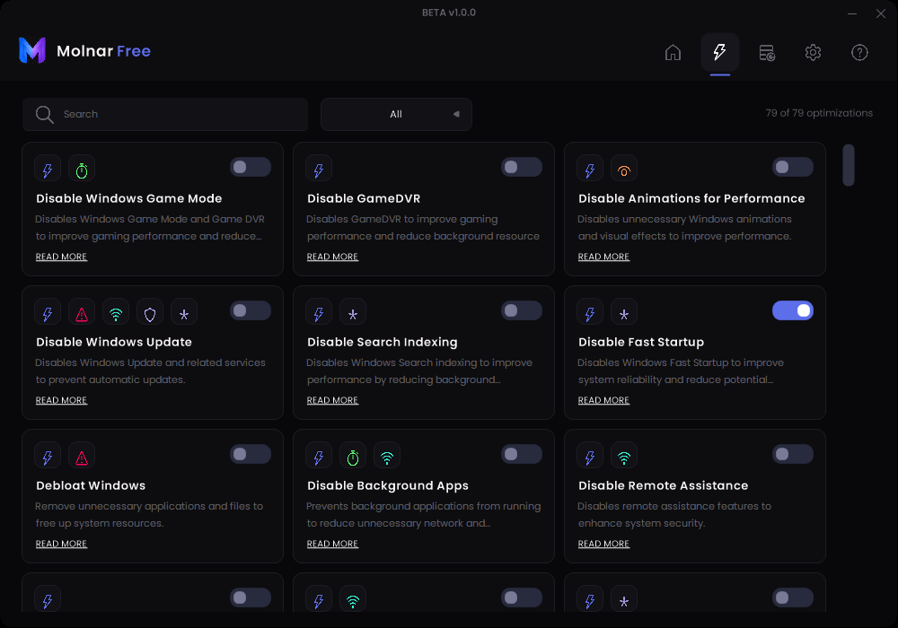
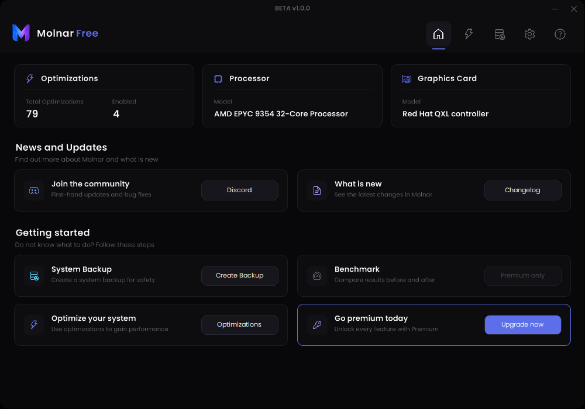
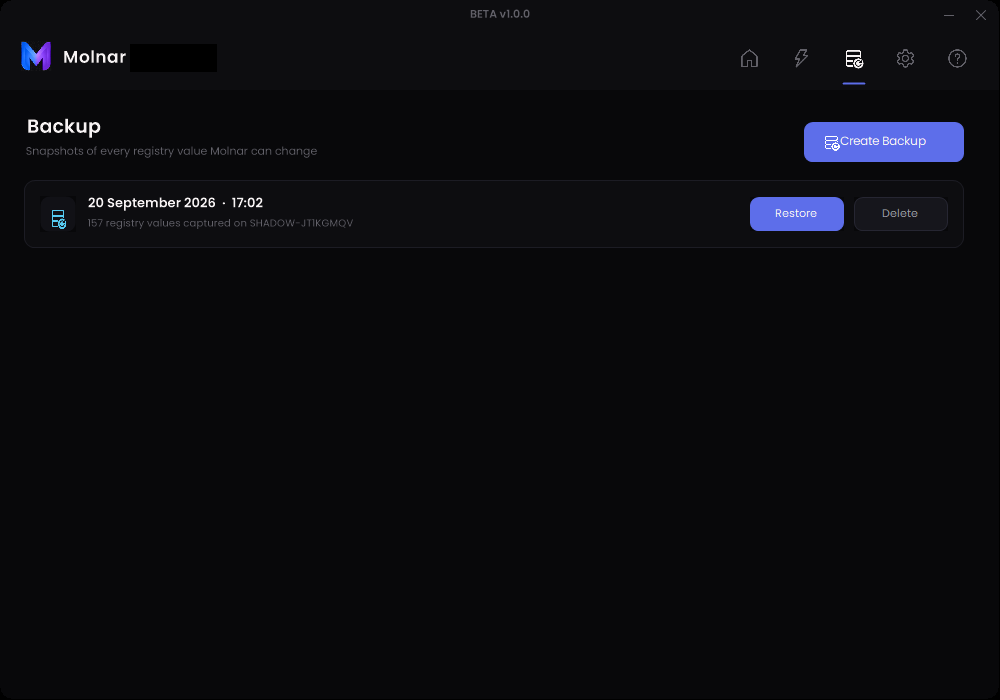
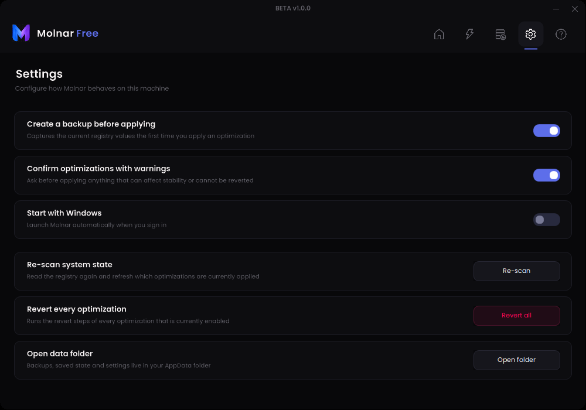
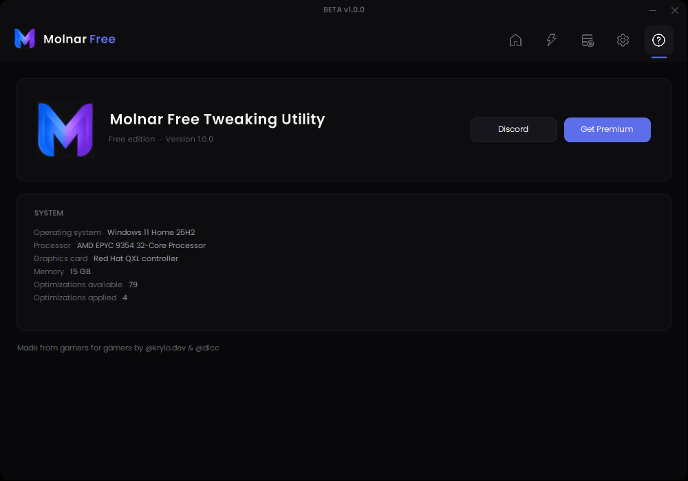

# Molnar Free Tweaking Utility

A free Windows optimization utility with 79 tweaks, built with WinForms on .NET 10.



<details>
<summary>More screenshots</summary>






</details>

## Features

- **79 optimizations** across 12 categories — performance, latency, network, security, privacy, telemetry, cleanup and more
- **Revertible** — every tweak that can be undone has explicit revert steps, and the ones that cannot are flagged before you apply them
- **Native registry access** — tweaks are applied through the Windows registry API, not by shelling out to `cmd`
- **Backups** — snapshot every registry value the app can touch, and restore it later
- **Live detection** — the app reads the registry on start to show what is already applied

## Categories

Performance · Warning · Latency · Network · Security · Temperature · Customization · Cleanup · Privacy · Telemetry · Programs · Misc

## Building

Requires the .NET 10 SDK and Visual Studio 2022 (17.14+) for the WinForms designer.

```
dotnet build "Molnar Free Tweaking Utility/Molnar Free Tweaking Utility.csproj"
```

The app requests administrator rights through its manifest, so running it from Visual Studio will prompt for elevation.

## Project layout

| Path | Contents |
| --- | --- |
| `Core/` | Tweak model, engine, registry helpers, backup service, theme |
| `Views/` | Dashboard, Optimizations, Backup, Settings, About pages |
| `Controls/` | TweakCard, CategoryChip, BackupRow |
| `Resources/tweaks.json` | The optimization catalog |
| `Assets/` | Logo and icons |

Colors live in `Core/Theme.cs`, category colors and icons in `Core/Categories.cs`.

## Warning

This application changes Windows settings on your machine, including update, telemetry and security-related settings. Create a backup before applying optimizations and read the details of anything marked with a warning. Use at your own risk.

## Built with

[Guna.UI2.WinForms](https://gunaui.com) · [CuoreUI](https://github.com/CuoreUI/CuoreUI) · icons by [Icons8](https://icons8.com)
